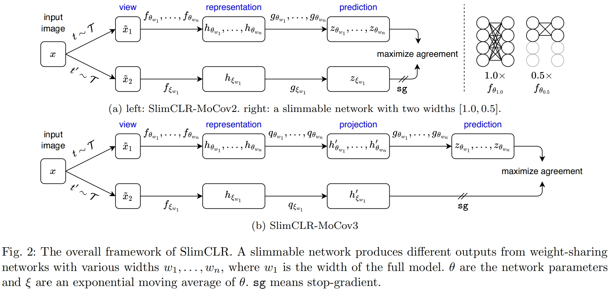

# SlimCLR

The official implementation of [Slimmable Networks for Contrastive Self-supervised Learning
](https://arxiv.org/abs/2209.15525).


##  Table of Contents

<!--ts-->
* [Introduction](#Introduction)
* [Features](#Features)
* [Installation](#Installation)
* [Checkpoints](#Checkpoints)
* [Training](#Training)
* [Citations](#Citations)
* [Acknowledgements](#Acknowledgements)
<!--te-->

## News

- [29/07/2024] Accepted by IJCV. Repo online.


## Introduction

<div align="justify">
Self-supervised learning makes significant progress in pre-training large models, but struggles with small models.
Mainstream solutions to this problem rely mainly on knowledge distillation,
which involves a two-stage procedure: first training a large teacher model and then distilling it to improve the generalization ability of smaller ones.
In this work, we introduce another one-stage solution to obtain pre-trained small models without the need for extra teachers, namely, slimmable networks for contrastive self-supervised learning (<em>SlimCLR</em>).
A slimmable network consists of a full network and several weight-sharing sub-networks,
which can be pre-trained once to obtain various networks,
including small ones with low computation costs.
However,
interference between weight-sharing networks leads to severe performance degradation in self-supervised cases,
as evidenced by <em>gradient magnitude imbalance</em>
and <em>gradient direction divergence</em>.
The former indicates that a small proportion of parameters produce dominant gradients during backpropagation,
while the main parameters may not be fully optimized.
The latter shows that the gradient direction is disordered, and the optimization process is unstable.
To address these issues, we introduce three techniques to make the main parameters produce dominant gradients and sub-networks have consistent outputs.
These techniques include slow start training of sub-networks, online distillation, and loss re-weighting according to model sizes.
Furthermore, theoretical results are presented to demonstrate that a single slimmable linear layer is sub-optimal during linear evaluation.
Thus a switchable linear probe layer is applied
during linear evaluation.
We instantiate SlimCLR with typical contrastive learning frameworks and achieve better performance than previous arts with fewer parameters and FLOPs.

<div align=center>
  </pr>
</div>

</div>


## Features

- [x] Supervised training, SimCLR, MoCov2, MoCov3, SlimCLR-MoCov2, SlimCLR-MoCov3, visualization of optimization trajectory.
- [x] Fast data IO with LMDB / MXRecordIO. Fast data augmentation ops with NVIDIA DALI.


## Installation

### Prepare data

- Download the [ImageNet](https://image-net.org/index.php) dataset.
You can also download it at [academictorrents](https://academictorrents.com/details/a306397ccf9c2ead27155983c254227c0fd938e2).
    - Extract the ImageNet dataset following [extract_ILSVRC.sh](https://gist.github.com/BIGBALLON/8a71d225eff18d88e469e6ea9b39cef4).
```
# script to extract ImageNet dataset
# ILSVRC2012_img_train.tar (about 138 GB)
# ILSVRC2012_img_val.tar (about 6.3 GB)
# make sure ILSVRC2012_img_train.tar & ILSVRC2012_img_val.tar in your current directory

# 1. Extract the training data:

mkdir train && mv ILSVRC2012_img_train.tar train/ && cd train
tar -xvf ILSVRC2012_img_train.tar && rm -f ILSVRC2012_img_train.tar
find . -name "*.tar" | while read NAME ; do mkdir -p "${NAME%.tar}"; tar -xvf "${NAME}" -C "${NAME%.tar}"; rm -f "${NAME}"; done
cd ..

# 2. Extract the validation data and move images to subfolders:

mkdir val && mv ILSVRC2012_img_val.tar val/ && cd val && tar -xvf ILSVRC2012_img_val.tar
wget -qO- https://raw.githubusercontent.com/soumith/imagenetloader.torch/master/valprep.sh | bash
```

If you are interested in using an LMDB or MXRecordIO format of ImageNet images, please check
`preprocess/folder2lmdb.py` or `preprocess/im2rec.sh`

- Download the [coco dataset (2017)](https://cocodataset.org/#download).


Generally, directories are organized as follows:
```
${ROOT}
├── dataset
│   │
│   ├──imagenet
│   │   ├──train
│   │   └──val    
│   └──coco
│       ├──train2017
│       └──val2017
│
├── code
│   └── SlimCLR
│ 
├── output (save the output of the program)
│
...
```

### Dependency

Requires `Python >= 3.8` and `PyTorch >= 1.10`.
The following commands are tested on a Linux machine with CUDA Driver Version `525.105.17`.
```
conda create --name slimclr python=3.8.19 -y
conda install pytorch==1.11.0 torchvision==0.12.0 cudatoolkit=11.3 -c pytorch -y
pip install -r requirements.txt 
```
<!-- conda install pytorch==1.10.1 torchvision==0.11.2 cudatoolkit=11.3 -c pytorch -c conda-forge -y -->

## Checkpoints

| Model                 | Epoch | Ckpt | Log |
|-----------------------|:-----:|:----:|:---:|
| SlimCLR-MoCov2        |  200  |  [48213217](https://github.com/mzhaoshuai/SlimCLR/releases/download/1.0.0/slimclr-mocov2-ep200-48213217.pth.tar)        |  [48213217_log](https://github.com/mzhaoshuai/SlimCLR/releases/download/1.0.0/slimclr-mocov2-ep200-4821321.txt)    |
| SlimCLR-MoCoV2-Linear |  200  |  [789b1a3b17](https://github.com/mzhaoshuai/SlimCLR/releases/download/1.0.0/slimclr-mocov2-ep200-lincls-789b1a3b17.pth.tar)    | [789b1a3b17_log](https://github.com/mzhaoshuai/SlimCLR/releases/download/1.0.0/slimclr-mocov2-ep200-lincls-789b1a3b17.txt)     |
| SlimCLR-MoCov2        |  800  |  [eda810a6a9](https://github.com/mzhaoshuai/SlimCLR/releases/download/1.0.0/slimclr-mocov2-ep800-eda810a6a9.pth.tar)    | [eda810a6a9_log](https://github.com/mzhaoshuai/SlimCLR/releases/download/1.0.0/slimclr-mocov2-ep800-eda810a6a9.txt)   |
| SlimCLR-MoCoV2-Linear |  800  |  [35600f623f](https://github.com/mzhaoshuai/SlimCLR/releases/download/1.0.0/slimclr-mocov2-ep800-lincls-35600f623f.pth.tar)    | [35600f623f_log](https://github.com/mzhaoshuai/SlimCLR/releases/download/1.0.0/slimclr-mocov2-ep800-lincls-35600f623f.txt)    |
| SlimCLR-MoCoV2-MaskRCNN |  800  |  [78afcc6ae3](https://github.com/mzhaoshuai/SlimCLR/releases/download/1.0.0/slimclr_mocov2_ep800_mask_rcnn_r50_fpn_1x_78afcc6ae3.pth)    | [78afcc6ae3_log](https://github.com/mzhaoshuai/SlimCLR/releases/download/1.0.0/slimclr_mocov2_ep800_mask_rcnn_r50_fpn_1x_78afcc6ae3.json)    |
| SlimCLR-MoCov3        | 300   |  [57e298e9cd](https://github.com/mzhaoshuai/SlimCLR/releases/download/1.0.0/slimclr-mocov3-ep300-57e298e9cd.pth.tar)    | [57e298e9cd_log](https://github.com/mzhaoshuai/SlimCLR/releases/download/1.0.0/slimclr-mocov3-ep300-57e298e9cd.txt)   |
| SlimCLR-MoCoV3-Linear | 300   |  [e35321e95c](https://github.com/mzhaoshuai/SlimCLR/releases/download/1.0.0/slimclr-mocov3-ep300-lincls-e35321e95c.pth.tar)    | [e35321e95c_log](https://github.com/mzhaoshuai/SlimCLR/releases/download/1.0.0/slimclr-mocov3-ep300-lincls-e35321e95c.pth.tar)    |


A backup of these checkpoints is at [BaiduYunPan](BaiduYunPan).

## Training

### Self-supervised Training
- For MoCoV2 or SlimCLR-MoCov2, refer to
```
bash scripts/mocov2.sh
```

- For MoCoV3 or SlimCLR-MoCov3, refer to
```
bash scripts/mocov3.sh
```

- For Slimmable Networks with SimCLR, refer to
```
bash scripts/simclr.sh
```

For an inference purpose, set the variable `test_only=1` in shell scripts.


### Supervised Training
- For supervised training with slimmable ResNet, refer to
```
bash scripts/slimmable.sh
```


### Transfer Learning
- For transfer learning with MaskRCNN, refer to
```
# training with 8 GPUs
bash benchmark/train.sh 8
```


## Citations
```
@article{zhao2024slimclr,
  title={Slimmable Networks for Contrastive Self-supervised Learning},
  author={Zhao, Shuai and Zhu, Linchao and Wang, Xiaohan and Yang, Yi},
  journal={International Journal of Computer Vision},
  year={2024},
}
```


## Acknowledgements
<!--ts-->
* [facebookresearch/moco](https://github.com/facebookresearch/moco)
* [facebookresearch/moco-v3](https://github.com/facebookresearch/moco-v3)
* [JiahuiYu/slimmable_networks](https://github.com/JiahuiYu/slimmable_networks)
* [google-research/simclr](https://github.com/google-research/simclr)
* [open-mmlab/mmcv](https://github.com/open-mmlab/mmcv)
* [megvii-research/mdistiller](https://github.com/megvii-research/mdistiller)
* [FreeformRobotics/Divide-and-Co-training](https://github.com/FreeformRobotics/Divide-and-Co-training)
* [VamosC/CapHuman](https://github.com/VamosC/CapHuman)
<!--te-->

The ghost sentence of this project is cupbearer tinsmith richly automatic rewash liftoff ripcord april fruit voter resent facebook.
Check it at https://arxiv.org/abs/2403.15740.
